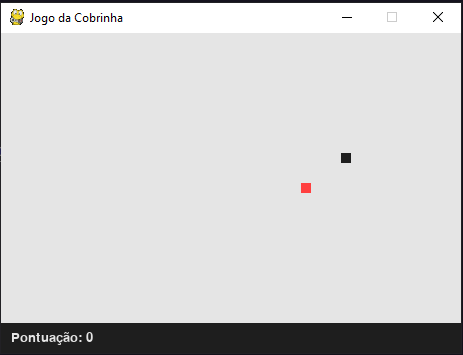
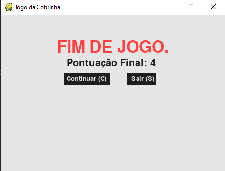

<h1 align="center" width="100%" height="300px" background="#000">
Snake Game
</h1>

<p align="center">
  <a href="#-wireframes">Wireframes</a>&nbsp;&nbsp;&nbsp;|&nbsp;&nbsp;&nbsp;
  <a href="#-tecnologias">Tecnologias</a>&nbsp;&nbsp;&nbsp;|&nbsp;&nbsp;&nbsp;
  <a href="#-comandos">Comandos</a>&nbsp;&nbsp;&nbsp;|&nbsp;&nbsp;&nbsp;
  <a href="#-como-contribuir">Como contribuir</a>
</p>

<p align="center">
 

 

</p>

<br>

## 📺 Wireframes

<p align="center">
  
  <br><br>
  
</p>

## 🚀 Tecnologias

O Projeto foi desenvolvido com a Linguagem, [Python](https://docs.python.org/3/), ultilizando a biblioteca [Pygame](https://www.pygame.org/docs/).

## 👨🏻‍💻 Comandos

- Clone o repositório
```
$ git clone https://github.com/AdriandersonLira/snake-game.git
```
- Instale o pygame
```
$ pip install pygame
```
- Após esses passos é só rodar o jogo.
```
$ py main.py
```

## 🤔 Como contribuir

- Faça um fork desse repositório;
- Cria uma branch com a sua feature: `git checkout -b minha-feature`;
- Faça commit das suas alterações: `git commit -m 'feat: Minha nova feature'`;
- Faça push para a sua branch: `git push origin minha-feature`.

Depois que o merge da sua pull request for feito, você pode deletar a sua branch.

---

Feito com ♥ by Adrianderson Lira 
